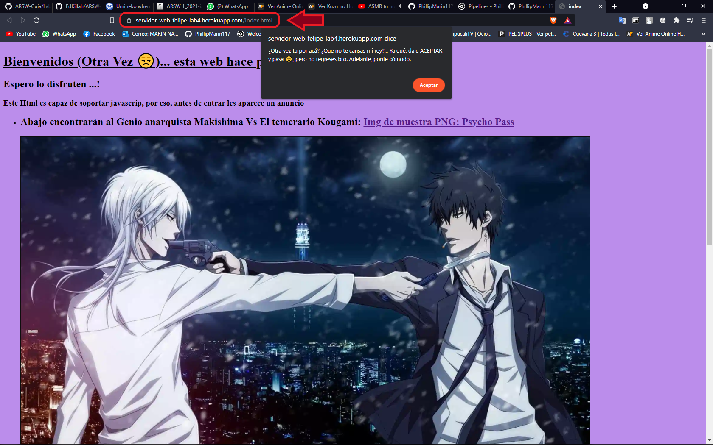

# Lab5 ARSW- Primeros Pasos con Heroku Spring

El siguiente repositorio contiene un programa sencillo de una aplicación web sobre el clásico juego de Picas & Famas el cual consiste en adivinar un número de una longitud dada y a medida que se intentan números se van revelando cuales posiciones tiene correctas y cuales números tiene dentro del numero original..
Este repositorio también cuenta con una breve explicacion del despliegue del servidor realizado en el  [laboratorio anterior](https://github.com/PhillipMarin117/ARSW-Lab4), este despliegue se realiza en Heroku

## Instrucciones de uso

Para poder usar el proyecto lo primero que debe realizar es clonar este repositorio utilizando el siguiente comando desde la terminal del S.O que este utilizando:

```
git clone https://github.com/PhillipMarin117/ARSW-Lab5
```
Otra alternativa es descargarlo directamente por formato ZIP en el botón que indica **"Clone or Download".**
Luego debe redirigirse por medio de la terminal al directorio raíz la cual contiene el archivo pom.xml.

Una vez se encuentre en este directorio se debe compilar el programa para esto se debe ejecutar el siguiente comando:

```
mvn package
```
### Prerequisitos

Para ejecutar con éxito este programa se requiere de los siguientes programas instalados en su máquina. Se recomienda tener las versiones actualizadas, pero si no al menos con las versiones básicas funcionales. Para lograr conocer si tiene instalados los programas y de paso la versión, ejecute los siguientes comandos
```
java -vesion
git --vesion
mvn -version
heroku --version
```

Le debería aparecer de la siguiente manera
```
java version: "1.8.0_171"
git version: 2.19.1.windows.1
Apache Maven version: 3.6.3
heroku/7.53.0
```
Una vez compliado el repositorio completo se encuentra en posibilidad de probar los siguientes ejercicios:


###  EJERCICIO 1  - Despliegue del servidor en Heroku

Despliegue el servidor web que desarrolló en el taller anterior en Heroku. Entregue su repositorio en github actualizado y el enlace a la aplicación ejecutándose en Heroku.

#### Comando para ejecutar HttpServer:
Primero debe dirigirse al laboratorio anterior por medio de este enlace: [Click Aquí.](https://github.com/PhillipMarin117/ARSW-Lab4)
```
java -cp target/ARSW-Lab4-1.0-SNAPSHOT.jar edu.escuelaing.arsw.app.HTTP.HttpServer
```
#### Despliegue en Heroku
En el siguiente enlace podrá encontrar el servidor desplegado
https://servidor-web-felipe-lab4.herokuapp.com/index.html


También puede abrir el mismo enlace para notar que soporta CSS:
https://servidor-web-felipe-lab4.herokuapp.com/bootstrap/index.html


###  EJERCICIO 2  - Picas y Famas en Heroku

Construya una aplicación en Spring que implemente el famosos juegos de picas y famas y que esté desplegada en Heroku. Entregue su repositorio en github actualizado y el enlace a la aplicación ejecutándose en Heroku.

#### Comando para ejecutar HttpServer:
Con el siguiente comando podrá desplegar el Juego.
```
java -cp target/ARSW-Lab4-1.0-SNAPSHOT.jar edu.escuelaing.arsw.app.SpringBootPicasFamasApplication
```
Si l desea tambien puede ejecutar el juego desde su computador de forma local. Una vez ejecutado diríjase a su navegador de confianza y escriba en el buscador **localhost:8080/juego** y lo dirigirá al juego creado por mi.

#### Despliegue en Heroku
En el siguiente enlace podrá encontrar el juego, solo debe darle en iniciar y listo.
https://picas-y-famas.herokuapp.com/


## Diagrama de clases

La siguiente imagen muestra los diagramas de clases contenidos en sus respectivos paquetes en los cuales se encuentran las clases de HtmlServer y las clases encargadas de la lectura de archivos solicitados por el cliente.


## Construido con


* [Maven](https://maven.apache.org/) - Dependency Management
* [Java](https://www.java.com/es/download/) - Lenguaje de programación
* [JavaScript](https://www.javascript.com/) - Lenguaje de programación
*  [HTML](https://html.spec.whatwg.org/multipage/) - Lenguaje de programación
*  [Spring ](https://spring.io/quickstart)  - Framework
* [Heroku ](https://spring.io/quickstart) - Despliegue Web
* [Git](https://github.com/) - Versionamiento


## Authors

* **Felipe Marín** - *LOCS/Hora  400/9 = 3.2 LOCS/Hora* - Fecha: 21/06/2021


## Licencia

This project is licensed under the MIT License - see the [LICENSE.md](LICENSE.md) file for details

## Enlace al sistema de integración continua

_A continuación se presenta el link:_
[](https://circleci.com/gh/PhillipMarin117/ARSW-Lab5)
